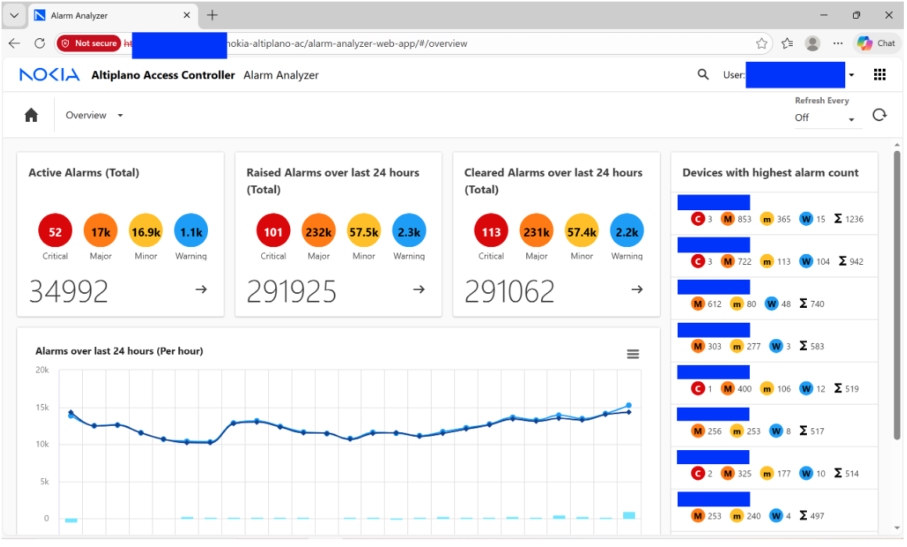
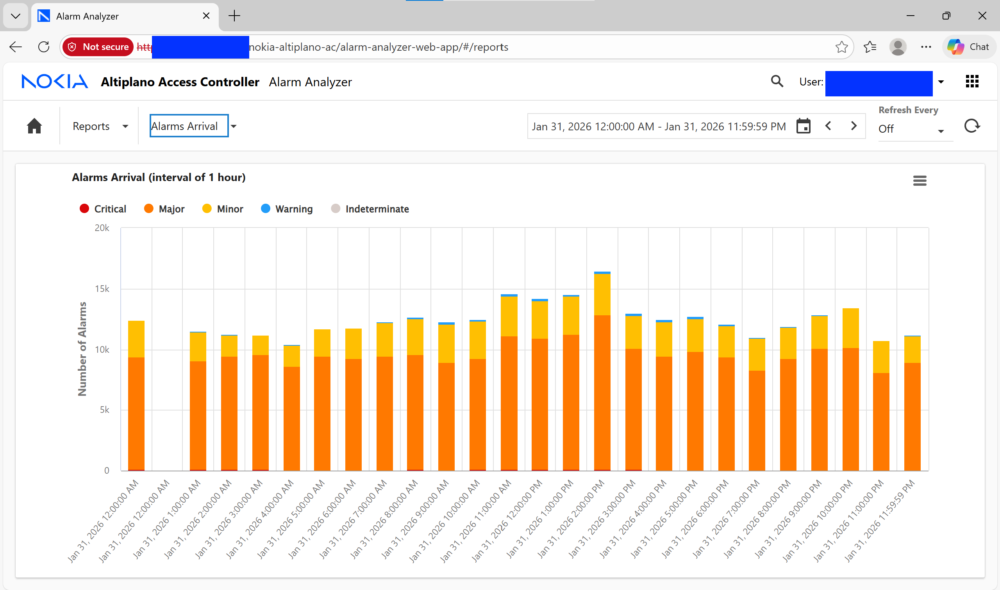
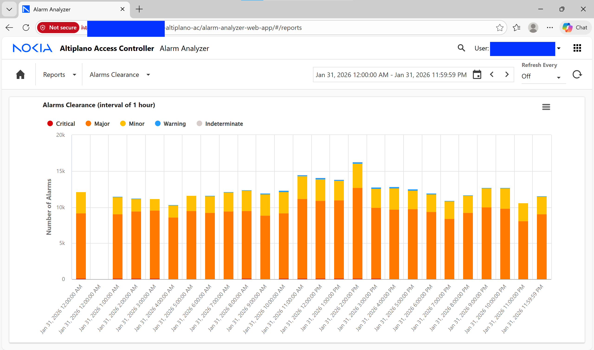
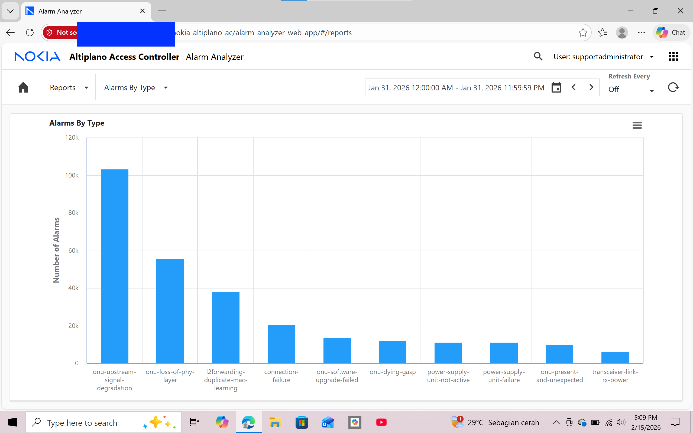
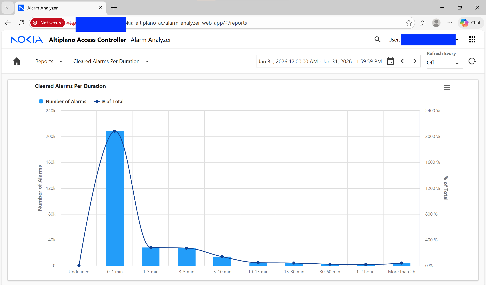
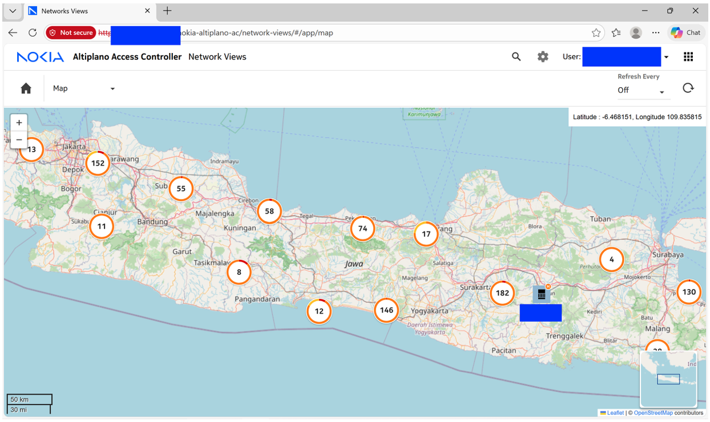

# 🌐 FTTH Alarm Monitoring and Network Analysis

## 📖 Overview

This project focuses on monitoring, analyzing, and troubleshooting alarms in a Fiber-To-The-Home (FTTH) network environment using the Nokia Altiplano Network Management System (NMS). The work involves alarm collection, severity analysis, network performance monitoring, and fault identification to support network reliability and service quality.

---

## 🎯 Project Objectives

- Monitor active and cleared alarms across the FTTH network.
- Analyze alarm trends and severity levels.
- Identify recurring network issues and potential root causes.
- Support troubleshooting and maintenance activities.
- Improve network visibility through dashboard-based monitoring.

---

## 🛠️ Tools & Technologies

- Nokia Altiplano NMS
- FTTH / GPON Network Infrastructure
- Microsoft Excel
- CSV Data Processing
- Alarm Analytics & Reporting

---

## 📷 Project Highlights

### Nokia Altiplano Platform

Used Nokia Altiplano NMS to monitor network conditions, investigate alarms, and analyze operational events across the FTTH infrastructure.

---

### Alarm Analysis Dashboard

Monitored active alarms, cleared alarms, alarm trends, and network events to evaluate service performance and identify potential issues.

---

### Alarm Arrival Statistics

Analyzed alarm arrival patterns to understand network behavior and identify abnormal spikes in alarm generation.

---

### Alarm Clearance Statistics

Evaluated alarm clearance performance and response effectiveness across network operations.

---

### Alarm Type Statistics

Categorized alarms based on fault type to identify the most frequent network issues.

---

### Cleared Alarm Duration Statistics

Analyzed alarm resolution duration to assess troubleshooting efficiency and maintenance performance.

---

### OLT Distribution Map

Visualized OLT deployment and network distribution to support operational monitoring and infrastructure analysis.

---

## 🚨 Common FTTH Alarms Analysis

| Alarm | Description | Possible Cause | Recommended Action |
|---------|-------------|----------------|-------------------|
| onu-upstream-signal-degradation | Upstream signal quality degradation | Fiber bending, drop cable issues | Repair or replace fiber/drop cable |
| onu-loss-of-phy-layer | Physical layer connectivity loss between ONU and OLT | Fiber disconnection | Check and repair fiber connection |
| onu-present-and-unexpected | ONU detected but not provisioned | ONU not registered | Perform ONU provisioning |
| l2forwarding-duplicate-mac-learning | Duplicate MAC address detected | Network loop or configuration error | Verify network configuration |
| transceiver-link-rx-power | Low optical receive power | Fiber attenuation or dirty connector | Clean connector and inspect fiber path |
| channel-termination-loss-of-signal | Signal loss on PON channel | Distribution fiber failure | Inspect feeder and distribution fiber |
| connection-failure | Communication failure between ONU and OLT | ONU or configuration issue | Verify ONU status and configuration |
| onu-software-upgrade-failed | Firmware upgrade process failed | Corrupted firmware or unstable connection | Re-run upgrade process |
| onu-dying-gasp | ONU sends final signal before shutdown | Power outage at customer side | Verify power supply |
| power-supply-unit-failure | Power supply malfunction | PSU damage or overheating | Replace PSU |
| power-supply-unit-not-active | Power supply inactive | Power cable disconnected or PSU failure | Check power source and PSU |

---

## 📂 Documentation

Project documents can be accessed below:

- 📄 [Final Report](docs/final_report.pdf)
- 📊 [Project Presentation](docs/project_presentation.pdf)

---

## 📌 Key Contributions

- Performed alarm monitoring and fault analysis on FTTH infrastructure.
- Conducted alarm severity and trend analysis.
- Investigated recurring network issues and root causes.
- Supported troubleshooting and operational reporting.
- Utilized Nokia Altiplano NMS for network performance monitoring.

---

## 🔮 Future Improvements

- Automated alarm classification using machine learning.
- Predictive maintenance based on alarm history.
- Real-time dashboard integration with database systems.
- Alarm correlation and root-cause analysis automation.

---

## 👩‍💻 Author

**Anindya Putri Defana**  
Electrical Engineering Student — Universitas Indonesia
